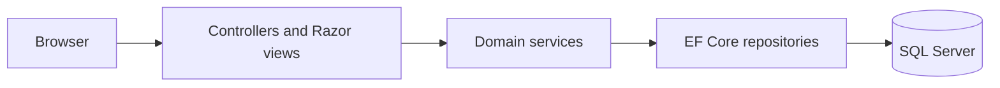

# Dalmatian Stud Book

An open-source dog pedigree database and kennel club management application built with C# and ASP.NET Core.

Dalmatian keeps dog records, parentage, owners, breeders and club registration information in one web application. It also records health test results, mating confirmations and birth certificates, connecting a dog's pedigree with the paperwork used by a breed club.

The project focuses on a Dalmatian club's stud book. Visitors can search dog records and browse kennels; club members and administrators have access to additional records and forms.

## Features

- **Dog records and pedigree:** pedigree names, photographs, dates of birth and death, colour, sire and dam links. Dog pages include parents, siblings and offspring lists.
- **Owners, breeders and kennels:** person records, owner-to-dog and breeder-to-dog listings, and kennel records.
- **Health records:** BAER hearing test results, hip and elbow ratings, test dates and other health test notes.
- **Breeding information:** breeding status, height, weight, country of origin and country of residence.
- **Mating confirmations:** sire, dam, mating date, mating type, estimated birth date and owner information.
- **Birth certificates:** registration number, birth date, associated mating, kennel, responsible person, litter letter and puppy counts by sex.
- **Club registration:** club and stud-book registration numbers attached to dog records.
- **Search and reports:** dog-name search with autocomplete, person search, dog listings by sex, colour and health, and ownership and breeder listings.
- **Accounts:** ASP.NET Core Identity and administration pages for users and roles, with `Administrator` and `ClubMember` access checks in controllers.
- **Contact form:** stores submitted messages and uses SendGrid for email delivery.

### Pedigree and litter scope

The dog model links each dog to its sire and dam. Dog pages show those parents and link to their records, with separate tables for siblings and offspring. Siblings are matched by both parents and date of birth. Pedigree browsing currently follows these links; configurable multi-generation charts and coefficient of inbreeding (COI) analysis are outside the implemented scope.

Litter information is recorded through birth certificates and family listings. The separate `Litter` model is currently empty, so a complete standalone litter-management module is not implemented.

## Architecture

The solution uses ASP.NET Core MVC with Razor views, a service layer and Entity Framework Core repositories.



Controllers also use ASP.NET Core Identity, repository and messaging services where needed. Cloudinary handles image uploads; SendGrid handles email.

| Directory under `src/` | Responsibility |
| --- | --- |
| `Web/Dalmatian.Web` | Application startup, MVC controllers, Razor views, Identity pages and static assets |
| `Web/Dalmatian.Web.ViewModels` | Form inputs and presentation models |
| `Web/Dalmatian.Web.Infrastructure` | Web infrastructure helpers |
| `Services/Dalmatian.Services.Data` | Dog, person, kennel and breeding-document operations |
| `Services/Dalmatian.Services.Mapping` | AutoMapper configuration |
| `Services/Dalmatian.Services.Messaging` | Email integration |
| `Data/Dalmatian.Data` | Database context, repositories, migrations and seed data |
| `Data/Dalmatian.Data.Models` | Domain entities |
| `Data/Dalmatian.Data.Common` | Shared entity and repository contracts |
| `Tests` | Existing test projects and sandbox |

`Dog` has self-referencing father and mother relationships and separate links to its owner and breeder. Health, breeding and registration records refer to a dog. `ConfirmationOfMating` connects two parent dogs; `BirthCertificate` connects a mating record with a person and kennel. Identity supplies user and role storage.

## Technologies

C#, ASP.NET Core 10, Entity Framework Core 10, SQL Server, ASP.NET Core Identity, Razor, AutoMapper, JavaScript, jQuery, Bootstrap, Font Awesome, Cloudinary and SendGrid. The solution also includes xUnit test projects.

`Startup.cs` selects SQL Server. SQLite package references exist in the web project, but SQLite is not the configured application database.

## Local setup

The current projects target .NET 10. The application was originally built with .NET Core 3.1; its development history is preserved below. Build and automated tests are checked separately from a full SQL Server deployment.

You need the .NET 10 SDK, NuGet access and a separate local SQL Server database. Visual Studio can open `src/Dalmatian.sln`.

```powershell
git clone https://github.com/angelneychev/Dalmatian.git
cd Dalmatian
cd src/Web/Dalmatian.Web

dotnet user-secrets set "ConnectionStrings:DefaultConnection" "Server=(localdb)\MSSQLLocalDB;Database=DalmatianDocumentationDemo;Trusted_Connection=True;MultipleActiveResultSets=true"
```

Use a new development database. Startup applies migrations in Development and runs seeders, including account and domain-data seeders. Review `src/Data/Dalmatian.Data/Seeding` before the first run, especially `UserSeeder.cs`; replace seeded account credentials before exposing an instance.

Provide your own integration settings through user secrets or environment variables:

| Setting | Purpose |
| --- | --- |
| `ConnectionStrings:DefaultConnection` | SQL Server connection |
| `Cloudinary:AppName` | Cloudinary cloud name |
| `Cloudinary:AppKey` | Cloudinary API key |
| `Cloudinary:AppSecret` | Cloudinary API secret |
| `SendGrid:ApiKey` | Email delivery |
| `GoogleReCaptcha:Key` | Contact form site key |
| `GoogleReCaptcha:Secret` | Contact form validation secret |

Cloudinary and SendGrid are registered at startup. Valid service configuration is needed to exercise uploads and email; an offline substitute is not documented here. Keep credentials out of tracked files.

From the web project directory:

```powershell
dotnet restore
$env:ASPNETCORE_ENVIRONMENT = "Development"
dotnet run
```

## Usage

Open the local address printed by the application.

- Search for a pedigree name on the home page and open a dog record to inspect its parents, siblings and offspring.
- Browse the kennel list to find kennel records.
- Sign in with a local club-member or administrator account to access protected records and reports.
- Use the mating confirmation and birth certificate screens for breeding paperwork. Creating these documents requires an administrator account in the current controllers.

Permissions are assigned per controller action. Review those attributes before changing the role model.

## History and status

The repository contains an `InitialCreate` migration named `20191224074400_InitialCreate.cs`, encoding 24 December 2019. That filename is evidence of the migration's recorded date, not proof of a public release on that date.

The first commit in the local branch history is [`be73b0e`](https://github.com/angelneychev/Dalmatian/commit/be73b0eab2ffbbebd7e0bd8152e6111d28f9c415), dated 3 March 2020 and titled `Add Template project`. That commit is also publicly accessible on GitHub. Commit `6c56f91`, dated 5 May 2020, records a later project reorganization. Commit dates establish the recorded development history; the date of the first public upload has not been established.

The .NET 10 update includes compatibility changes for EF Core, AutoMapper and application diagnostics. Club workflows coexist with unfinished parts such as the standalone litter model. SQL Server startup, external integrations and a production deployment still need environment-specific verification.

## Dependency notes

The project uses AutoMapper 16. Review its [license configuration](https://docs.automapper.io/en/stable/License-configuration.html) before deployment. A license key, when applicable, belongs in environment configuration (`AUTOMAPPER_LICENSE_KEY`), not in source control.

Cloudinary uses the current `CloudinaryDotNet` package. ASP.NET Core HTTP types and System.Text.Json come from the .NET 10 frameworks. Browser libraries in `libman.json` retain their existing versions; this update covers the .NET projects and their NuGet dependencies.

Run the automated checks with:

```powershell
dotnet build src/Dalmatian.sln --configuration Release
dotnet test src/Dalmatian.sln --configuration Release --no-build
```

The service tests include dog search projection through AutoMapper and EF Core soft-delete/restore checks. The three existing web and Selenium examples remain explicitly skipped and do not verify a live deployment.

## Contributing

Open an issue with the affected screen or workflow, steps to reproduce and the expected result. For code changes, keep pull requests focused and run the relevant existing tests. Documentation corrections and application screenshots using non-sensitive demo data are welcome.

## License and author

[MIT License](LICENSE). Created by [Angel Neychev](https://github.com/angelneychev).
